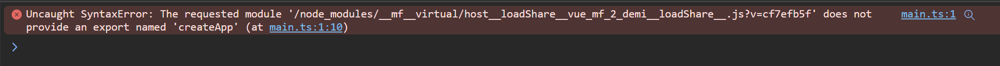
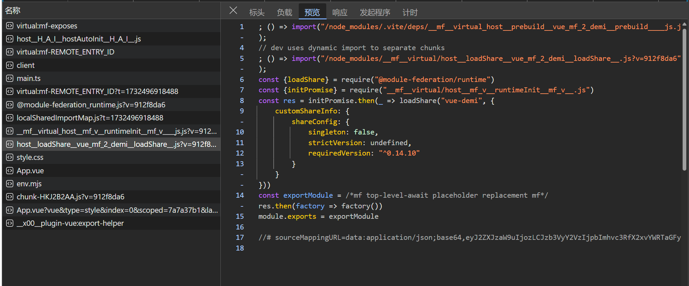

# module federation shared "vue-demi" library packaging error

## Problem Recurrence

1. git clone warehouse,
2. run the 'pnpm install' command to install the dependency,
3. run the 'pnpm dev' command to start the project,
4. Open your browser to 'http://localhost:5000'

## Results

### console

### bundler
